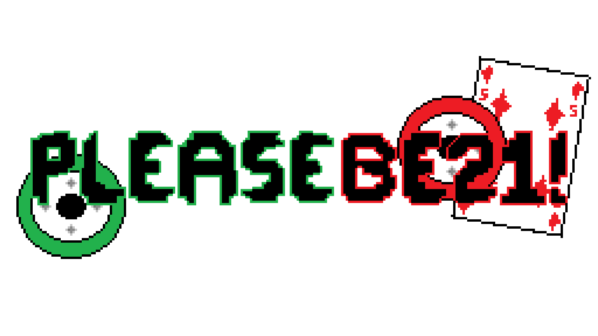
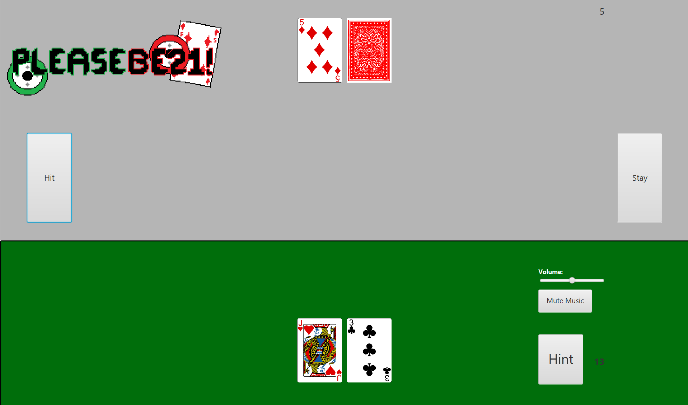
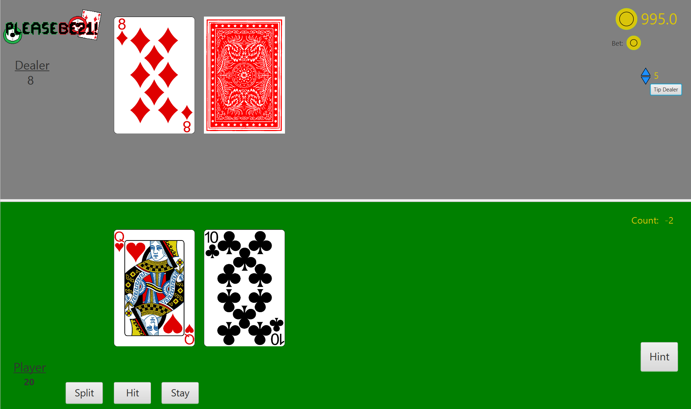

# 

## 📌 Overview
A Team Software Project project that desires to be a fast-paced blackjack-esque game. 

## 🚀 Features
- ✅ Hit or Stay Feature.
- ✅ Card Randomization.
- ✅ Simple UI Design.
- ✅ "Learn to Play" Tutorial.
- ✅ Betting Currency.

## 📸 Sprint Screenshots
#### Sprint 1
##### - Added base game functionality. The hit or stay buttons function correctly, but you must load the MAIN game through IDE.

#### Sprint 2
##### - Added hint button as well as Background Music. (Later got removed for later). Changed UI design to look more like a Blackjack Table.

#### Sprint 3
##### - Main Game functionality is done. We shifted our focus to adding a Tutorial, Title Pane, High Score page, and Settings Page. (High Score and Settings are yet to be done.)

