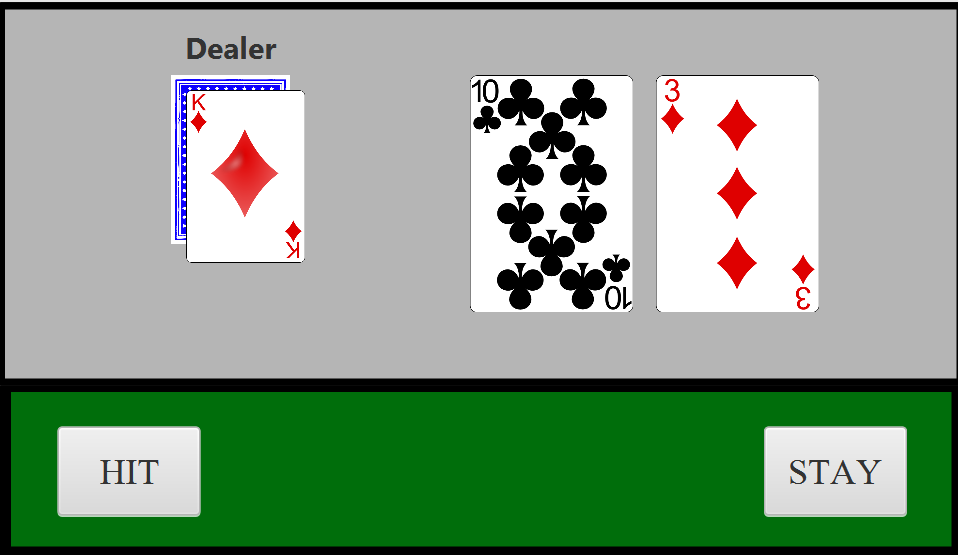

# 

# PleaseBe21!

## 📌 Overview
A Team Software Project project that desires to be a fast-paced blackjack-esque game. 

## 🚀 Features
- ✅ Hit or Stay Feature.
- ✅ Card Randomization.
- ✅ Simple UI Design.

## 📸 Screenshots

